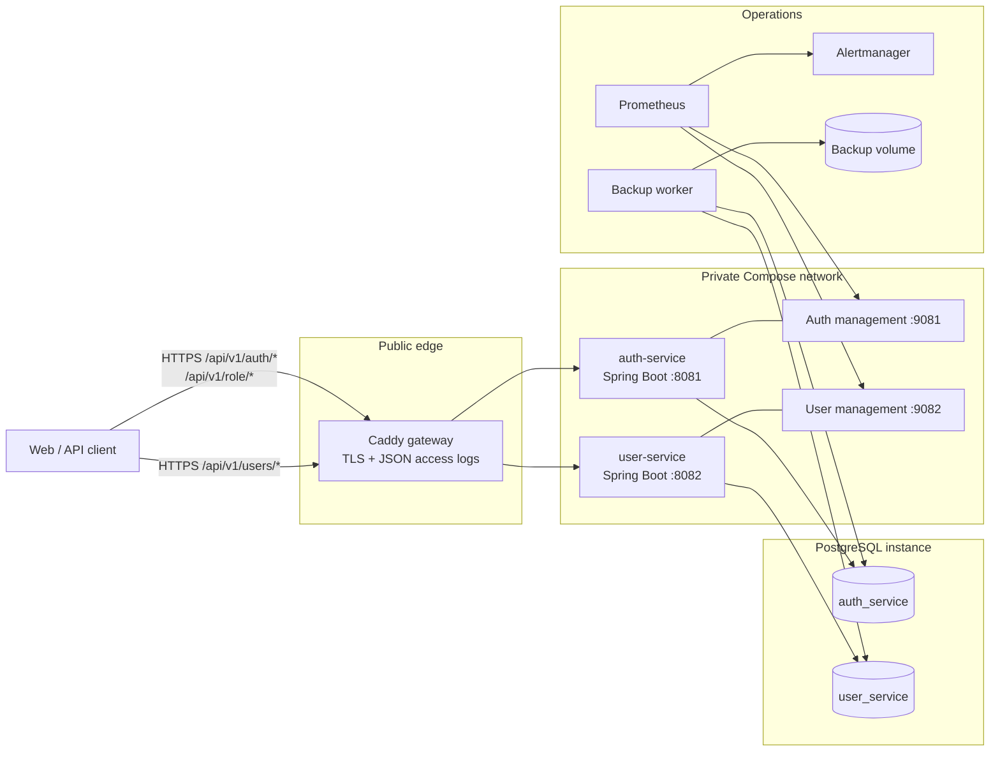
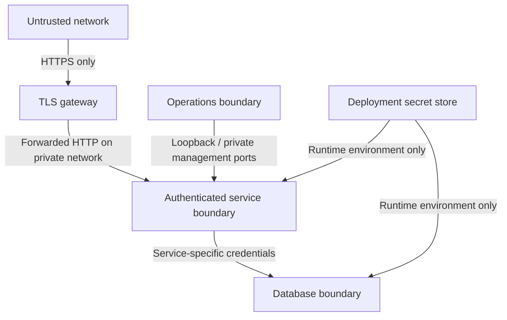
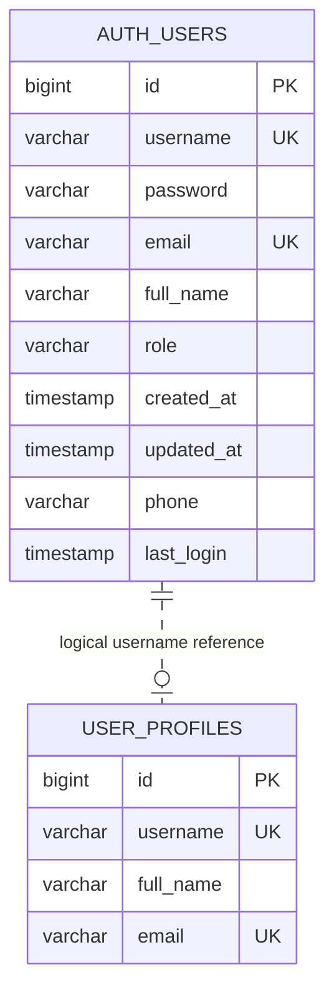
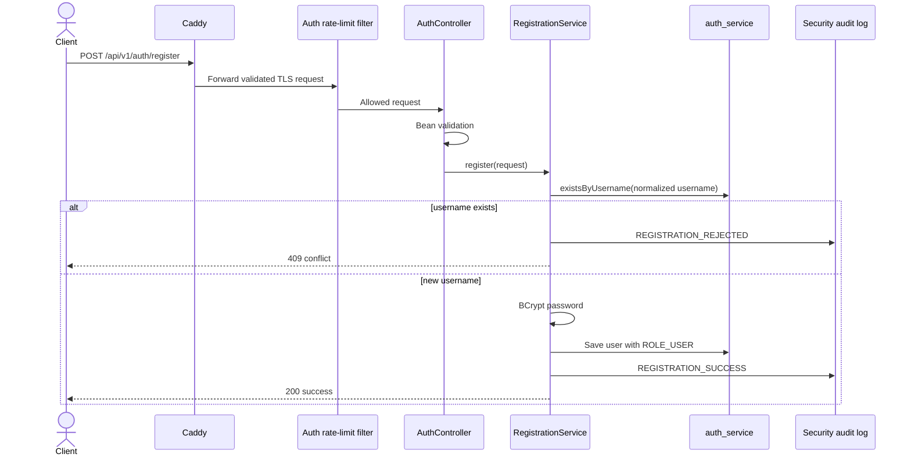
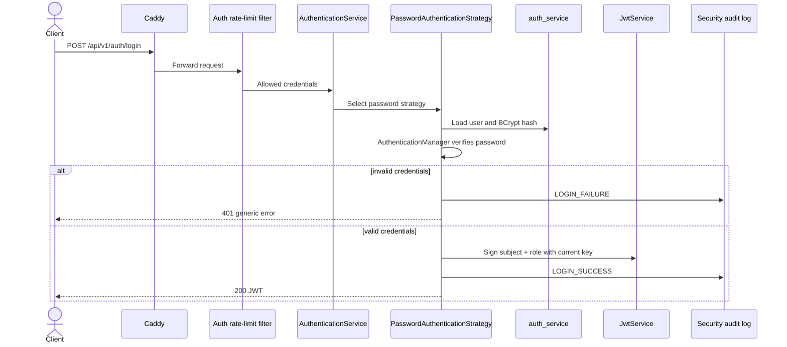
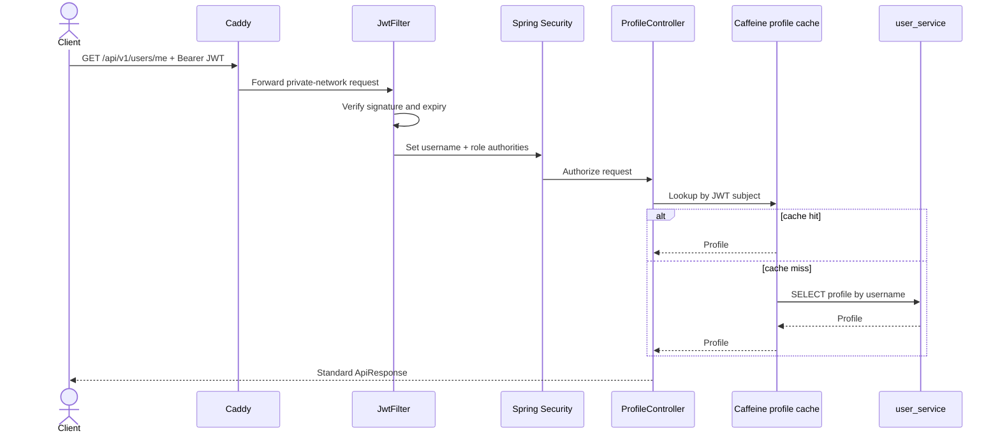
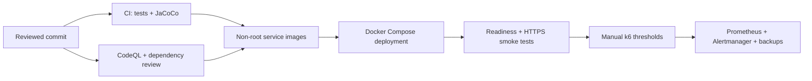

# User Access Management Architecture

## 1. System context

User Access Management is a Maven multi-module system with two independently
deployed Spring Boot services. Caddy is the only public application entry point
and terminates TLS before routing versioned API paths.

Public traffic cannot directly reach management ports. Service debug ports,
Prometheus, and Alertmanager bind to host loopback for local operations only.

## 2. Source modules and ownership

| Module/component | Owns |
| --- | --- |
| `core` | JWT parsing/signing, security filter, shared DTOs, exceptions, audit logger, CORS policy, OpenAPI and logging configuration |
| `auth-service` | Registration, password authentication, role checks, user credentials, JWT issuance |
| `user-service` | Profile commands/queries, profile cache, profile database |
| `gateway` | TLS termination, route mapping, security headers, access logs |
| `monitoring` | Metrics scraping, service/latency/error/heap alerts |
| `operations` | Verified PostgreSQL backups, runbook, disaster recovery |

`core` is a library, not a network service. A change to shared security code
requires rebuilding and deploying both application services.

## 3. Trust boundaries

Security rules:

- Caddy redirects HTTP to HTTPS and emits structured access logs.
- Each service owns its URL authorization rules; `JwtFilter` only validates a
  presented bearer token and builds the Spring Security context.
- JWT signing keys must contain at least 256 bits. During a planned rotation,
  both services accept the current and previous verification keys, while only
  the current key signs new tokens.
- Registration always creates `ROLE_USER`; public input cannot assign an
  administrator or moderator role.
- Passwords are BCrypt hashes in `auth_service`; raw passwords and JWT values
  must never be logged.
- CORS uses an explicit list of trusted origins.

## 4. Data architecture

The system follows database-per-service ownership even though both databases
currently run in one PostgreSQL container.

There is no cross-database foreign key. `profiles.username` is a logical
reference to the JWT subject issued for `users.username`. The user service does
not query `auth_service`; it trusts a valid JWT and uses its subject as the
profile key.

Flyway owns both schemas:

- `auth-service` migrations create and evolve `users`.
- `user-service` migrations create `profiles`. Migration V3 preserves the
  obsolete `user_profiles` table as `legacy_user_profiles` for reconciliation
  instead of deleting unknown data.
- Hibernate schema generation is disabled in production.

## 5. Registration flow

The rate limiter is keyed by client identity and has bounded in-memory state.
Validation rejects weak passwords and malformed usernames before persistence.

## 6. Login and JWT issuance

Authentication errors are deliberately generic. Internal exception messages,
database details, credentials, and stack traces are not returned to clients.

## 7. Authenticated profile read

The profile cache is local to each user-service process, bounded by maximum
entries and expiry time. Successful upsert and delete operations evict the
affected username so later reads cannot return a known stale value. JWT
validation results are intentionally not cached.

## 8. Availability and operations

- Docker health checks use Actuator readiness endpoints on private management
  ports.
- Prometheus scrapes both services and evaluates availability, 5xx rate, p95
  latency, and JVM heap pressure.
- Alertmanager groups alerts. A production deployment must add an external
  notification receiver.
- The backup worker creates custom-format dumps for both databases, validates
  them with `pg_restore --list`, writes SHA-256 checksums, and enforces
  retention.
- Caddy, service containers, PostgreSQL, monitoring, and backup worker have
  explicit CPU, memory, and process limits.

Operational procedures are defined in:

- `operations/RUNBOOK.md`
- `operations/DISASTER_RECOVERY.md`

## 9. Deployment and verification path

The performance workflow is manual because it targets a deployed HTTPS
environment and requires a dedicated test account from the GitHub `performance`
environment secrets.

## 10. Architectural constraints

- Both services must use the same current JWT key and key-rotation window.
- Database ownership must not be bypassed with cross-service table access.
- Administrative access belongs to service security rules and method
  authorization; it must not be inferred from request input.
- List endpoints must remain paginated and bounded.
- Cache entries must be bounded and invalidated on writes.
- New public endpoints must use `/api/v1`, OpenAPI annotations, validation,
  authorization rules, and standard exception responses.
- New long-running or retryable background work should use a durable queue or
  scheduler. `@Async` alone is not a durability guarantee.
